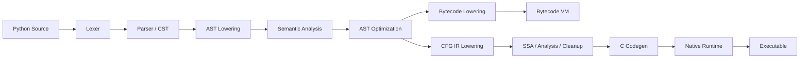

# Python VM-First Compiler

A Python-subset compiler and runtime with two execution lanes:

- a **VM lane** that serves as the semantic source of truth
- a **native lane** that lowers to IR, emits C, and links a runtime

This project is no longer just “Python to C”. It is a **VM-first compiler architecture** with a serious native backend that is being expanded in controlled stages.

## Why This Project Exists

Most language projects choose one of two paths:

- build a toy frontend and stop before runtime complexity
- or build a large backend before the language surface is stable

This project takes a different approach:

- grow the language on a custom VM first
- validate semantics with tests
- expand the native backend only when the runtime model is ready

That keeps iteration fast without pretending the native lane is already at full parity.

## What It Does

At a high level, the compiler:

1. reads Python source
2. lexes and parses it
3. lowers it into a project-owned AST
4. runs semantic validation
5. either:
   - lowers to bytecode and executes on the VM
   - or lowers to IR, optimizes, emits C, and builds a native executable

## Architecture



## Execution Model

### VM lane

The VM lane is the broader and more mature path.

It is the right way to think about the project today if you care about:

- supported language features
- semantic correctness
- rapid feature evolution
- most real execution behavior

### Native lane

The native lane is intentionally narrower.

It already has real compiler infrastructure:

- CFG lowering
- SSA-style optimization
- ownership / decref placement
- exceptional liveness and cleanup
- C emission
- runtime linkage

But it is still a smaller supported subset than the VM lane. Native support should be treated as **incremental and runtime-driven**, not as full language parity.

## Core Subsystems

### Frontend

`compiler/frontend`

- source handling
- lexer
- owned parser
- CPython-backed parse/lower flow
- CST and AST lowering

### Semantic analysis

`compiler/semantic`

- symbol collection
- name resolution
- type checking
- control-flow validation

### VM runtime

`compiler/vm`

- bytecode lowering
- bytecode interpreter
- runtime objects
- builtins
- VM error handling

### Native compiler

`compiler/ir`

- CFG model
- lowering
- SSA passes
- ownership passes
- exception cleanup

`compiler/backend`

- C code generation

`compiler/runtime`

- emitted native runtime support

### Orchestration

`compiler/pipeline/`

- analyze / execute / compile orchestration
- frontend selection
- feature gating for native compilation

## Capability Contract

The detailed feature truth source is:

- [docs/feature_matrix.md](docs/feature_matrix.md)

That file tracks:

- parser acceptance
- VM support
- native support
- automated test coverage

The README intentionally stays at the architecture and product level. It should explain the system clearly, not duplicate every capability row.

## Supported Surface, At A High Level

### Broadly available on the VM lane

The VM lane already supports a substantial Python subset, including:

- functions, recursion, forward references
- closures and `nonlocal`
- exceptions and `try/finally`
- imports and relative imports
- lists, tuples, dicts, sets, indexing, slicing
- unpacking
- comprehensions
- generators and `yield from`
- classes, inheritance, and decorators

### Broadly available on the native lane

The native lane is strongest today at:

- arithmetic
- simple control flow
- function calls
- key exception/control-transfer cases
- homogeneous primitive list/tuple literals, indexing, slicing, `len()`, truthiness, equality, membership, and display
- optimization and codegen infrastructure

### Still intentionally limited on the native lane

The native lane is not yet the place for:

- general container semantics
- closures
- generators
- imports / multi-file compilation
- full object-model parity

Again: use the feature matrix for exact status.

## Project Status

This codebase has reached the point where **architecture discipline matters more than adding random syntax**.

The project is now primarily about:

- capability governance
- runtime maturity
- execution-lane boundaries
- correctness under growth
- maintaining a clear contract between VM and native behavior

That is a good sign. It means the project has moved beyond the “toy compiler” stage.

## Current Development Priorities

Priority order:

1. stabilize architecture
2. keep capability documentation accurate
3. reduce orchestration bottlenecks
4. expand the native runtime in deliberate slices

The current native-runtime tranche is now underway:

1. homogeneous primitive tuples/lists
2. indexing
3. `len()`
4. slicing with a restricted native contract

The next step inside that tranche is to broaden container parity beyond the current homogeneous primitive list/tuple subset without losing cleanup and ownership correctness. This remains the right focus because it exercises:

- allocation
- ownership
- cleanup
- exception safety
- runtime helpers
- lowering
- IR
- code generation

without immediately forcing:

- native generators
- full object-model parity
- descriptors
- native imports

## Repository Layout

```text
compiler/
  backend/      C code generation
  cli/          command-line entrypoints
  core/         AST, types, signatures, visitors
  frontend/     lexer, parser, CST, AST lowering
  ir/           CFG, SSA, analysis, ownership, cleanup
  optimizer/    AST-level optimizations
  runtime/      emitted native runtime support
  semantic/     symbols, resolution, type checking, control flow
  utils/        diagnostics and logging
  vm/           bytecode lowering, interpreter, runtime helpers

docs/
  feature_matrix.md

tests/
  unit and integration coverage
```

## Getting Started

### Install

```bash
pip install -e .
```

### Run through the VM

```bash
python3 main.py program.py
```

### Analyze only

```bash
python3 main.py program.py --check
```

### Compile to native C artifacts

```bash
python3 main.py program.py --compile-native
```

### Compile and run natively

```bash
python3 main.py program.py --run-native
```

### Inspect internal representations

```bash
python3 main.py program.py --dump tokens
python3 main.py program.py --dump bytecode
python3 main.py program.py --compile-native --dump ir
```

### Use module / installed entrypoints

```bash
python3 -m compiler program.py
python-subset-compiler program.py
```

## Testing

Run the full test stack with:

```bash
python3 -m unittest discover -s tests -v
python3 run_tests.py
```

CI runs both:

- unit tests
- integration tests

See:

- `.github/workflows/ci.yml`

## Practical Notes

- `--run` remains a legacy alias for `--run-native`
- `--no-viz` is accepted for CLI compatibility
- generated files like `output.c`, `py_runtime.c`, and `py_runtime.h` are build artifacts, not the primary source of truth
- the active implementation is the package under `compiler/`

## Roadmap Direction

Near-term:

- keep the feature matrix authoritative
- rewrite and simplify architecture boundaries
- continue splitting and simplifying `compiler/pipeline/`
- add native containers

Later:

- native runtime maturity
- object-model expansion
- stronger tooling gates
- more formal language-contract documentation

## Bottom Line

This is a **compiler engineering project**, not just a syntax experiment.

The VM lane already makes it a meaningful Python-subset runtime.
The native lane already makes it a meaningful compiler backend.
The next step is not “add random features”.
The next step is to **stabilize the architecture and expand native runtime capability deliberately**.
